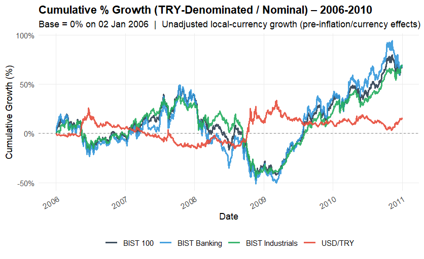

# **Key Takeaways**

-   **20-Year Historical Scope:** This study analyzes the quantitative relationship between the USD/TRY exchange rate and BIST indices across a 20-year span (2006–2026), utilizing 5-year analysis windows to detect structural shifts.

-   **The Regime-Dependent Banking Pivot (Your Core Insight):** The Banking sector (`XBANK.IS`) exhibits a strong regime-dependent behavior. Under stable/tight monetary regimes where the exchange rate is controlled, Banking significantly outperforms other sectors due to predictable margins. Conversely, during rapid currency depreciation or highly volatile exchange rate regimes, Banking severely underperforms and lags behind other indices due to balance sheet shocks.

-   **The 2011–2020 Depreciation Drag:** During the 2011–2015 and 2016–2020 periods, significant currency depreciation (USD/TRY doubling and tripling) was highly correlated with negative USD-denominated returns, leaving the vulnerable Banking sector at its historical lows.

-   **Structural Break & Equity Hedge (2021–2026):** In a historical anomaly, the most recent period (2021–2026) shows that despite a massive six-fold increase in USD/TRY (from 100 to over 600), BIST indices broke historical patterns and served as a robust hedge against hyper-depreciation, yielding positive USD-denominated returns.

-   **Industrial Resilience vs. Banking Volatility:** Across all analyzed cycles, the Industrial index (`XUSIN.IS`) consistently offered the most stable hedge against currency inflation, while the Banking sector (`XBANK.IS`) remained the most volatile but staged a dramatic valuation recovery in USD terms post-2021.

# Period-Based Analysis

::: panel-tabset
## 2006-2010

Below are the visual insights for the first analysis window:

   

## 2011-2015

Analysis of the second 5-year period:

   

## 2016-2020

Market dynamics during the currency shocks of late 2010s:

   

## 2021-Present

Recent structural shifts and capital preservation trends:

   
:::
